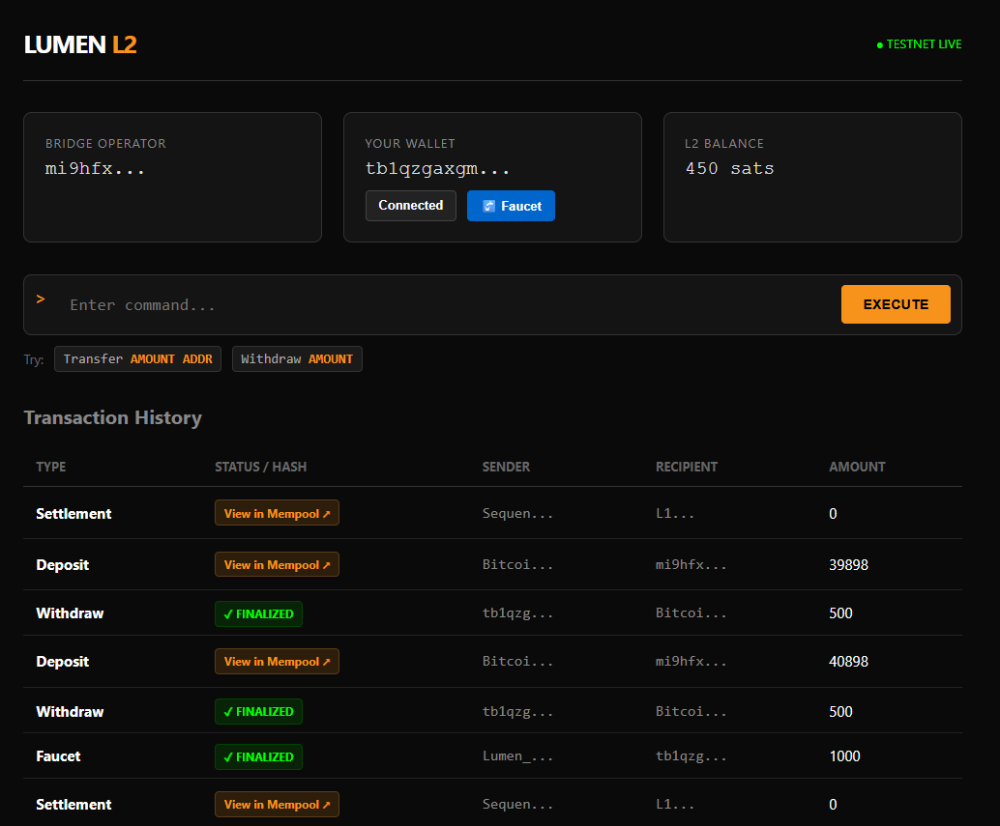

# Lumen-btc-l2: SVM-based Bitcoin L2 🟠

**Lumen-btc-l2** is a modular Layer-2 solution that brings the speed of Solana (SVM) to the Bitcoin network. We utilize Bitcoin for Data Availability (DA) and Settlement via the **Nubit** protocol, enabling high-performance DeFi applications secured by the world's most robust blockchain.



## 🚀 Key Features
* **Stateful SVM Execution:** The node maintains a persistent global state and executes smart contract logic (e.g., Global Counter).
* **Bitcoin Security:** Transactions are batched, serialized, and anchored to the Bitcoin network via **Nubit DA**.
* **Live Block Explorer:** Real-time web dashboard visualizing block height, transaction details, and Data Availability hashes.
* **Modular CLI:** A dedicated command-line interface for key management (ed25519) and signed transaction dispatch.

## 🏗 Architecture
This MVP demonstrates the complete lifecycle of a rollup transaction:
1.  **User Interaction:** The user signs an instruction (e.g., `Increment`) using `lumen-cli`.
2.  **Sequencer (Node):** Validates the cryptographic signature and routes the transaction to the VM.
3.  **Execution Layer:** The Virtual Machine updates the in-memory **Global State**.
4.  **Data Availability:** The Sequencer aggregates state diffs into batches and submits them to **Nubit** (Bitcoin DA).
5.  **Visualization:** The Block Explorer reads the state and DA logs to display real-time network status.

## 🗺 Roadmap

### Phase 1: MVP & Core Structure (Completed) ✅
- [x] **Core Node Initialization:** Setup Rust workspace and basic node structure.
- [x] **SVM Integration:** Integrate Solana Virtual Machine for local transaction execution.
- [x] **Data Availability (Mock):** Implement abstract DA adapter interface.
- [x] **Bitcoin Connection:** Establish connection to Bitcoin Testnet types.

### Phase 2: Network & Security (Completed) ✅
- [x] **JSON-RPC Server:** Axum-based API for receiving transactions.
- [x] **Mempool System:** Thread-safe storage for pending transactions.
- [x] **Sequencer Logic:** Automated batching of transactions (10s interval).
- [x] **Cryptography:** Signature verification using Solana SDK (ed25519).

### Phase 3: Live Integration (Completed) ✅
- [x] **Nubit DA:** Integration with live Data Availability layer (simulated/testnet).
- [x] **Lumen-CLI:** Client tool for wallet creation (`create-wallet`) and transfers.
- [x] **Logging:** Structured logs (`batches.log`) tracking all Bitcoin anchors.

### Phase 4: Smart Contracts & State (Completed) ✅
- [x] **Global State:** Implementation of in-memory state management (`AppState`).
- [x] **Smart Contracts:** Logic for stateful instructions (`Increment` command).
- [x] **Live Explorer:** Web-UI connected to real-time node state and DA history.

### Phase 5: Persistence & Future (Next Steps) 🚧
- [ ] **Data Persistence:** Integration of RocksDB/Sled to save state across restarts.
- [ ] **Trustless Bridge:** Development of an SPV client for BTC bridging.
- [ ] **Developer SDK:** Tools for deploying complex Anchor contracts.

## ⚡ Quick Start

### 1. Start the Node (Sequencer)
```bash
cargo run -p node
```
### 2. Create a Wallet
```bash
cargo run -p lumen-cli -- create-wallet
```
### 3. Interact with Smart Contract
```bash
cargo run -p lumen-cli -- increment
```
### 4. View Explorer
Open http://127.0.0.1:3000/explorer